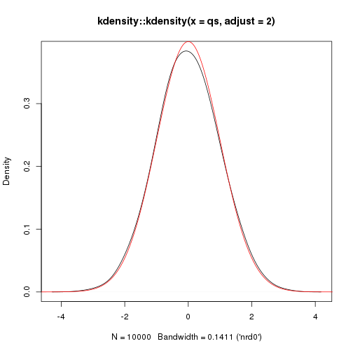

Hamiltonian Monte Carlo
========================================================
author: Jonas Moss
date: Mars 2018
autosize: true

The Hamiltonian
========================================================

* $p_{i}$: The ith momentum component ($mv$).
* $q_{i}$: The ith position component.
* $\mathcal{H}$: The Hamiltonian.
* Hamiltonian dynamics:
  * $\frac{dp_{i}}{dt} = \frac{\partial \mathcal{H}}{\partial q_{i}}$
  * $\frac{dq_{i}}{dt} = -\frac{\partial \mathcal{H}}{\partial p_{i}}$

What about the physics?
========================================================
* Assume $\mathcal{H} = U(q) + K(p)$ 
* $U$ is the *potential energy* of our particle in position $q$.
* $K$ is the *kinetic energy* of our particle with momentum $p$.
* Newton's 2nd law: $F=ma=\frac{dq}{dt}$
  * Potential energy: Think of a "gravity well". The potential energy
    is zero at the bottom of the well.
* Velocity: $\frac{dp_{i}}{dt} = v$
  * Kinetic energy: $K(q) = \frac{1}{2}mv^2$

Hamiltonian dynamics
========================================================
* Restatement of Hamiltonian dynamics:
  * $F = \frac{dp_{i}}{dt} = \frac{\partial U}{\partial q_{i}}$
  * $v = \frac{dq_{i}}{dt} = -\frac{\partial K}{\partial p_{i}}$
* Energy is conserved: Think of a frictionless surface 
  with no air resistance.
* Consequence: When the potential energy is low, the kinetic energy is high. 
  The particle will always move about.
  
Hamiltionians in probability.
========================================================  
* Recall that $\mathcal{H} = U(q) + K(p)$ 
* Let $U(q) = -\log\pi(q)$: The potential energy surface is the nagative logarithm of the target density.
* Let $K(p) = -\log\pi(p)$: The kinetic energy is the negative logarithm of the momentom proposal density.
* The moment proposal density is typically normal, so that
$K(p) \propto \frac{1}{2m}||q||^2$ for some mass $m$. Provides a good argument
for using a normal moment proposal.

Idealized Hamiltonian Monte Carlo
========================================================
For an initial position $p^{0}$, repeat a large number of times.

1. Sample a momentum from $\pi(q)$, the moment proposal density.
2. Integrate the Hamiltonian dynamics for some time.
3. Use the position variable as $p^{i+1}$.

Problem: Explicit solutions are rare.
========================================================
Write down the solution of normal x normal. Recall that
only linear differential equations can be expected to 
be analytically solveable. 

```r
summary(cars)
```

```
     speed           dist       
 Min.   : 4.0   Min.   :  2.00  
 1st Qu.:12.0   1st Qu.: 26.00  
 Median :15.0   Median : 36.00  
 Mean   :15.4   Mean   : 42.98  
 3rd Qu.:19.0   3rd Qu.: 56.00  
 Max.   :25.0   Max.   :120.00  
```

Normal distribution: A harmonic oscillator
========================================================
Write down the solution of normal x normal. Recall that
only linear differential equations can be expected to 
be analytically solveable. 

Euler's method 
========================================================
Euler's method does not work well. Illustrate with a 
drawing. Runge-Kutta doesn't help either. 


Geometric integrators
========================================================
Find out something about these: Also symplectic. Big field of study in its own
right.

The Leapfrog
========================================================
Describe the method

Performance of Leapfrog
========================================================
Show the performance on normal

Properties of Leapfrog
========================================================
* Second order method; Euler is first order (say what it is)
* Is time-reversible
* Conserves Angular Momentum
* Conserves Volume (Symplectic)

Fixing the inexactness
========================================================
We use Metropolis to fix the inexactness of the method. Describe.

Choosing L and epsilon
========================================================
Describe how to choose L and epsilon

A summary of where we are:
========================================================

How many samples to take from a trajectory.
========================================================
