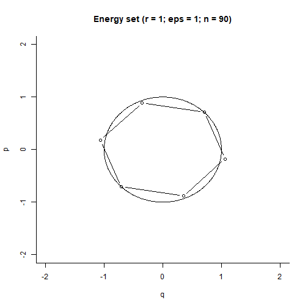

Hamiltonian Monte Carlo
===============================================================================
author: Jonas Moss
date: Mars 2018
autosize: true
transition: zoom
transition-speed: slow
navigation: section
width: 1440
height: 900
font-family: 'Helvetica'

The Hamiltonian
===============================================================================
type: section
incremental: true
* $p_{i}$: The ith momentum component ($mv$).
* $q_{i}$: The ith position component.
* $\mathcal{H}$: The Hamiltonian.
* Hamiltonian dynamics:
  * $\frac{dp_{i}}{dt} = \frac{\partial \mathcal{H}}{\partial q_{i}}$
  * $\frac{dq_{i}}{dt} = -\frac{\partial \mathcal{H}}{\partial p_{i}}$
* Proscribes how $(p, q)$ moves in time.

What about the physics?
===============================================================================
type: sub-section
incremental: true
* Assume $\mathcal{H} = U(q) + K(p)$ 
* $U$ is the *potential energy* of our particle in position $q$.
* $K$ is the *kinetic energy* of our particle with momentum $p$.
* Newton's 2nd law: $F=ma=\frac{dq}{dt}$
  * Potential energy: Think about gravity. The potential energy of an object
    caught in Earth's gravitational field is $mgh$: Here $g = a$ in this case,
    $h$ is the distance from the Earth.
* Velocity: $\frac{dp_{i}}{dt} = v$
  * Kinetic energy: $K(q) = \frac{1}{2}mv^2$

Hamiltonian dynamics
===============================================================================
type: sub-section
incremental: true
* Restatement of Hamiltonian dynamics:
  * $F = \frac{dp_{i}}{dt} = \frac{\partial U}{\partial q_{i}}$
  * $v = \frac{dq_{i}}{dt} = -\frac{\partial K}{\partial p_{i}}$
* Energy is conserved: Think of a frictionless surface 
  with no air resistance.
* Consequence: When the potential energy is low, the kinetic energy is high. 
  The particle will always move about.
* Running the Hamiltionan dynamics explores an *energy level* of the 
  $p\times q$ phase space. 
  
Hamiltionians in probability.
===============================================================================  
type: sub-section
incremental: true
* Recall that $\mathcal{H} = U(q) + K(p)$ 
* Let $U(q) = -\log\pi(q)$: The potential energy surface is the negative 
  logarithm of the target density.
* Let $K(p) = -\log\pi(p)$: The kinetic energy is the negative logarithm of the 
  momentom proposal density.
* The moment proposal density is typically normal, so that
  $K(p) \propto \frac{1}{2m}||q||^2$ for some mass $m$. 
* Since classical kinetic energy is $K(q) = \frac{1}{2}mv^2$, this provides a 
  good argument for using a normal moment proposal.

Idealized Hamiltonian Monte Carlo
===============================================================================
type: section
incremental: true
* For an initial position $p^{0}$, repeat a large number of times.
  1. Sample a momentum from $\pi(q)$, the moment proposal density.
  2. Integrate the Hamiltonian dynamics for some time.
  3. Use the position variable as $p^{i+1}$.
* Just one form of idealized HMC: This is the Markov variant.
  * Possible to have an idealized non-Markov HMC as well!

Problem: Explicit solutions are rare.
===============================================================================
type: sub-section
incremental: true
* Systems of differential equations are almost never analytically solvable.
* Honorable exception: Linear systems are solvable using eigenvalue 
  decomposition.
* We have to *numerically integrate* the Hamiltionan system in order to obtain
  estimats of $p(t), q(t)$.
* Adds several complications: Must choose tuning parameters.
* (++) Books have been written on integrating Hamiltonian systems.
  * Look up "symplectic integration", "geometric integration", 
    "integrating Hamiltonian".
  * Connected to classical problems such as the n-body problem.

Normal distribution: A linear problem
===============================================================================
type: section
incremental: true

* $U(q) = - \log(\pi(q)) = \frac{q^2}{2}$: Normal target distribution.

* $K(p) = - \log(\pi(p)) = \frac{p^2}{2}$: Normal proposal distribution.

* System reduces to
  \[
  \begin{array}{ccc}
  \frac{dq_{i}}{dt} & = & p\\
  \frac{dp_{i}}{dt} & = & q
  \end{array}
  \]

Normal distribution: A harmonic oscillator
===============================================================================
type: sub-section
incremental: true
* Solutions:
  \[
  \begin{array}{ccc}
  q\left(t\right) & = & r\cos\left(a+t\right)\\
  p\left(t\right) & = & -r\sin\left(a+t\right)
  \end{array}
  \]

* Circle with radius $r = \sqrt(p^2 + q^2)$ and shift $a$. 

* The energy is $E = \frac{1}{2}(p^2 + q^2) = \frac{1}{2}r^2$

Normal distribution: Plot
===============================================================================
type: sub-section


What about the energy distribution?
===============================================================================
type: section
incremental: true
* The energy level is distributed according to $\frac{1}{2}\chi^2(2)$.
* Alternative sampling strategy: 
  1. Sample $E$ from $\frac{1}{2}\chi^2(2)$, 
  2. $(q, p)$ uniformly from the circle with radius $\sqrt(-2E)$.  
  3. Project on $q$.
* Hamiltonian Monte Carlo without Markoc Chains.
* Exact sampling: Equivalent to the popular *Box-Muller transform*.
  * Note that $\chi^2(2) = \exp(1/2)$
  * Not the fastest algorithm since $log$, $cos$, $sin$ are expensive to 
    evaluate.
  
Energy distribution, R code
===============================================================================
type: sub-section
incremental: true

```r
set.seed(313)
n = 10000
E = 1/2*rchisq(n, 2)
theta = runif(n, 0, 2*pi)
q = sqrt(2*E)*cos(theta)
p = -sqrt(2*E)*sin(theta)
```

Energy distribution, density
===============================================================================
type: sub-section


Monte Carlo variant
===============================================================================
type: section
incremental: true
* Monte Carlo change:
  1. Sample $E_{i+1}$ from $\frac{1}{2}(\chi^2(1) + q_{i}^2)$, 
  2. $(q, p)$ uniformly from the circle with radius $\sqrt(2E)$.  
  3. Project on $q$.
* Note that $E \sim \frac{1}{2}\chi^2(2)$ in the limit when $q_{i}$.
* And vice versa!

Monte Carlo variant, R  code
===============================================================================
type: sub-section
incremental: true

```r
n = 1000
q = rep(0, n) # Positions, normal 
E = rep(0, n) # Energies, 1/2*chi^2(2) 
p = rnorm(n, mean = 0, sd = 1)
theta = runif(n, 0, 2*pi) 

for(i in 2:n) {
  E[i] = 1/2*(q[i - 1]^2 + p[i]^2)
  q[i] = sqrt(2*E[i])*cos(theta[i])
}
```

Monte Carlo variant, ACF
===============================================================================
type: sub-section
incremental: true


Monte Carlo variant, density
===============================================================================
type: sub-section
incremental: true


Monte Carlo variant, energies
===============================================================================
type: sub-section
incremental: true


Euler's method 
===============================================================================
type: section
incremental: true
Light and simple differential equation solver. 
\[
\begin{array}{ccc}
p_{i}\left(t+\epsilon\right) & = & p_{i}\left(t\right)+\epsilon\frac{dp_{i}}{dt}\left(t\right)\\
q_{i}\left(t+\epsilon\right) & = & p_{i}\left(t\right)+\epsilon\frac{dq_{i}}{dt}\left(t\right)
\end{array}
\]

For Hamiltonian dynamics:
\[
\begin{array}{ccc}
p_{i}\left(t+\epsilon\right) & = & p_{i}\left(t\right)-\epsilon\frac{dU}{dq_{i}}\left(t\right)\\
q_{i}\left(t+\epsilon\right) & = & q_{i}\left(t\right)+\epsilon\frac{dK}{dp_{i}}\left(t\right)
\end{array}
\]

Euler's method is unacceptable!
===============================================================================
incremental: true
type: sub-section


The Leapfrog
===============================================================================
incremental: true
type: section
A *symplectic integrator*. Known as the velocity vervlet.
\[
\begin{eqnarray*}
p_{i}\left(t+\frac{\epsilon}{2}\right) & = & p_{i}\left(t\right)-\frac{\epsilon}{2}\frac{dU}{dq_{i}}\left(q_{i}\left(t\right)\right)\\
q_{i}\left(t+\epsilon\right) & = & q_{i}\left(t\right)+\epsilon\frac{dK}{dp_{i}}\left(p_{i}\left(t+\frac{\epsilon}{2}\right)\right)\\
p_{i}\left(t+\epsilon\right) & = & p_{i}\left(t+\frac{\epsilon}{2}\right)-\epsilon\frac{dU}{dq_{i}}\left(q_{i}\left(t+\epsilon\right)\right)
\end{eqnarray*}
\]

Some Motivation
===============================================================================
incremental: true
type: sub-section
* Euler: $y(t+\epsilon) = y(t) + \epsilon f(y(t))$; based on $g'(x)
  \approx \frac{1}{\epsilon}(g(x + \epsilon) - g(x))$ 
* Numerical differentation of the form 
  $\frac{1}{\epsilon}(g(x + \epsilon) - g(x))$ approximates the derivative at 
  the midpoint: $g'(x + \frac{1}{2}\epsilon)$ Think about the words 
  "Intermediate Value Theorem".
* Hence $y(t+\epsilon) = y(t) + \epsilon f(y(t + \epsilon/2))$ should be more
  accurate. (And it is!) This method is called midpoint Euler (MAT-INF1100).
* Using this reasoning on the Hamiltonian system yields the leapfrog.

Performance of Leapfrog (eps = 1)
===============================================================================
incremental: true
type: sub-section


Performance of Leapfrog (eps = 0.1)
===============================================================================
type: sub-section


Properties of Leapfrog
===============================================================================
type: sub-section
1. Second order method: In general better than Euler. 
  * Measures how much the error grows in terms of $\epsilon$. First order has
    error $O(\epsilon)$ second order $O(\epsilon^2)$ etc.
2. Is time reversible:
  * You can recover the trajectory by reversing the signs in the algorithm.
3. Conserves volume:
  * If a section of phase-space is transformed by Hamiltonian dynamics, the
    volume is preserved.
  * The Leapfrog preserves volume as well!
  * Puts severe restrictions on the ability of leapfrog to diverge.

Choosing L and epsilon
===============================================================================
type: sub-section
* $L$: Number of \epsilon steps taken.
  * Too small makes the sampler more Metropolisy: Uses a long time to explore 
    an energy level.
  * Too large takes a long time to compute.
  * Large $L$ will transfer you back to the beginning.
* $\epsilon$: The step-size used in the leapfrog integrator.
  * Too small epsilon is inefficient; too large is inexact.
* Hoffman, Gelman (2014): No-U-Turn Sampler
  * Selects $L$ and $\epsilon$ adaptively while preserving time-reversibility.
  * Is used in `STAN`.
  
Fixing the inexactness
===============================================================================
type: section
* The Leapfrog integrater is inexact.
* To fix the inexactness we use Metropolis-Hastings decide on whether to
  accept a sample or not. 
* The goal is to make the $(p, q)$-sampling work as intended, then project.
* Acceptance probability: 
  $\min(1, \exp(\mathcal{H}(q_L, p_L)) − \exp(\mathcal{H}(q_0, p_0)))$
* Note: Only used to fixed inexactness, no Metropolis-Hastings for the normal
  experiment!


