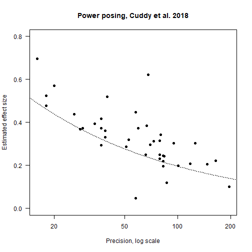
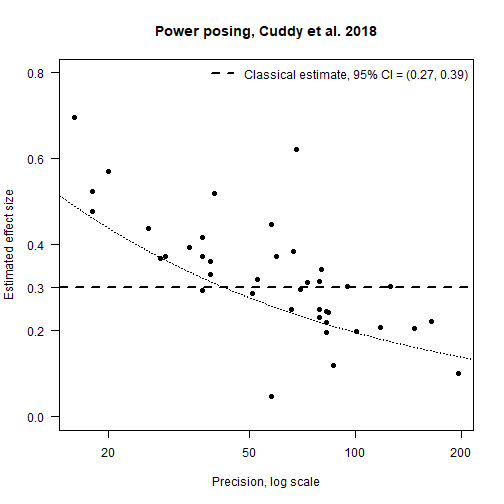
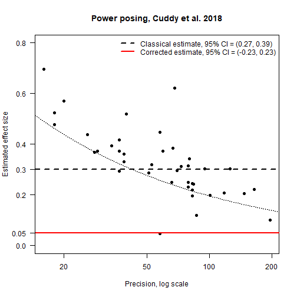
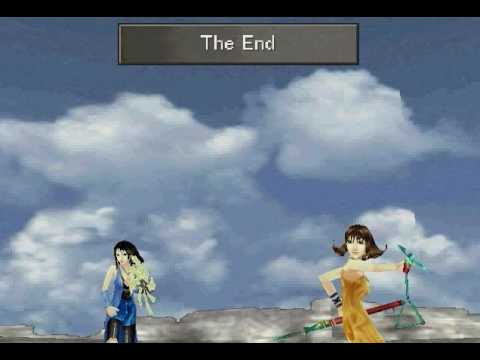

On the Twin Spectres: Publication Selection Bias and p-hacking
========================================================
author: Jonas Moss
date: 11 ottobre
autosize: true
transition: none

What are the spectres?
========================================================
incremental: true

- **Context:** You have a claim such as "coffee drinking is associated with a
  rise in serum cholesterol (LDL)" with associated effect sizes and *p*-values 
  from the scientific literature.
- **Publication selection bias:** Positive results have a higher chance of 
  being published than negative or inconclusive results. 
  - *Positive* usually means significant at $\alpha = 0.05$.
- ***p*-hacking**: Persistent reanalaysis of data to obtain siginficant results.
- **Consequences**: Our cherished beliefs are false!

Why understand the spectres?
========================================================
incremental: true

- **Frequentists:** Obtain corrected *p*-values, confidence intervals, and
  estimated effects for single studies. Maybe do it all in a frequentist 
  decision theory way.
- **Bayesians:** Get your posterior right! (Everything follows from this.)
- **Meta-analysis:** Correct for the influence of the bias.
- **Researchers:** Do better study planning when e.g. choosing sample size.
- **Everyone:** Do you have reason to trust this study?

Idealized Version of Publication Selection
========================================================
incremental: true

**Setting:**  One researcher, one journal.

1. The researcher conducts a study and submits it, with completely honest 
   reporting.
2. The journal editor makes a publication decision. It a accepts with 
   probability $\rho(u)$, where $u$ is the *p*-value of study. 
3. If the study is not published, it is lost forever!
4. Rinse and repeat.

The Likelihood for Publication Selection
========================================================
incremental: true

**Underlying model:** What would have been the correct model for a summary datum
$x$ if there was no publication selection at all.

- *Example:* $x \sim N(\theta, \textrm{se})$ for some $\theta$.
- *General case:* $p(x \mid \theta, \phi)$ is some density.

**Weighting function selection model:** 
Recall that $u$ is a *p*-value and $\rho(u)$ a probability for each $u$. Then
Iyengar & Greenhouse (1988) introduced:

$$p^\star(x \mid \theta, \phi) \propto \rho(u)p(x \mid \theta, \phi)$$

- Is always a density; the normalizing factor is bounded by 1.
- Can be understood as a *rejection sampling model*.

Problems with the Idealized Version of Publication Selection
========================================================
incremental: true
1. **Endogeneity.** A researcher is likely to do studies that have a high 
   likelihood of success: If those with high likelihood of success are *boring*, 
   the probability of publication will not depend only on $u$.
2. **Presence of many journals.** If infinitely many journals have $\rho(u)>0$,
   every study will be published if the researcher is persevering.
3. **Minor problems!** The model is essentially correct.

How to Choose the Publication Probability
========================================================
incremental: true

- **Continuous functions**
    - *Parametrics:* Beta density with $\alpha, \beta \geq 1$, Kumaraswamy 
      density. Any bounded parameterized density. 
    - *Non-parametrics:* Bernstein polynomials, splines, etc.
    - *Why:* Can model unforseen selection functions. But publication selection
      appears to happen at fixed thresholds.

- **Step functions**
   - $p \leq 0.05$ is magic. Something definitely happens there.
   - $p \leq 0.10$ and $p \leq 0.01$ are *maybe* somewhat magical.
   - What about larger thresholds? Seems redundant. Who cares whether $p = 0.20$
     or $p = 0.30$?
     
Example: Power posing
========================================================
title: false

Example: Power posing
========================================================
title: false

Example: Power posing
========================================================
title: false

Idealized Version of p-hacking
========================================================
incremental: true

**Setting:**  One researcher, one journal. The researcher is an expert 
*p*-hacker. If she wants significance at the $\alpha$-level, she will get it.

1. The researcher plans to conduct a study. She draws an $\alpha$-level from
   a distribution $\pi(\alpha)$ and *p*-hacks the study to this level.
2. The journal makes accepts to paper no matter what.
3. No study is ever lost!
4. Rinse and repeat.

The Likelihood for p-hacking
========================================================
incremental: true

**Mixture model:** Recall that $u$ is a *p*-value and $\pi(\alpha)$ a density.
- Let $p_{u\in[0,\alpha]}\left(x\mid\theta,\phi\right)$
be the underlying density truncated to the domain $u \in [0, \alpha]$. 

- **Idea:** $p_{u\in[0,\alpha]}\left(x\mid\theta,\phi\right)$ is 100% *p*-hacking to
  the $\alpha)$-level.

- My model: $$p^\star(x \mid \theta, \phi) = \int_{[0,1]}p_{u\in[0,\alpha]}\left(x\mid\theta,\phi\right)\pi\left(\alpha\right)d\alpha$$
- Can be understood as a two-stage sampling model. First draw from $\pi$, then
  from $p_{u\in[0,\alpha]}\left(x\mid\theta,\phi\right)$
  
Problems with the Idealized Version of p-hacking
========================================================
incremental: true

1. *Problem with the Idea:* Researchers are probably not perfect *p*-hackers.
   Perhaps they p-hack as much as they manage to do.
2. *Problem with the implementation of the idea:* Does truncation model 
   *p*-hacking well? Does a perfect p-hacker generate something like truncated 
   variables?
3. *Conclusion:* Might be something to work with here!

Combining the Models
========================================================
incremental: true

Here's how the combined model works:

1. The researcher *p*-hacks a study to some level given by $\pi(\alpha)$.
2. The editor accepts with probability $\rho(u)$.
3. If it isn't published, it is lost.
4. Model statement:

\[
p^{\star}\left(x\mid\theta,\phi\right)\propto\rho\left(u\right)\int_{[0,1]}p_{u\in[0,\alpha]}\left(x\mid\theta,\phi\right)\pi\left(\alpha\right)d\alpha
\]

Pros and Cons with the Combined Model
========================================================
incremental: true

- **Pros:**
  - Takes both publication bias and *p*-hacking explicitly into account!
  - Has a clear and simple justification.
  - Performance? I don't know --- probably super though.

- **Cons:**
  - Is it identifiable? 
  - Is it possible to estimate it? 
  - Will not work well with frequentist measures.

The End
========================================================
title: false

