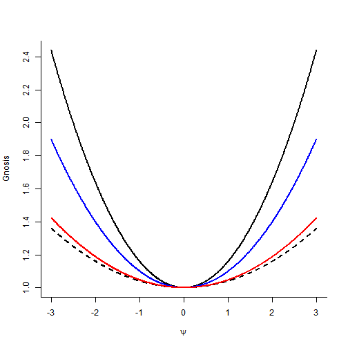

Association Measures
========================================================
author: Jonas Moss
date: 1/9/2019
autosize: true
width: 1366
height: 768

*One on tiptoe cannot stand; one whose legs are spread cannot walk.*

Generalizing the Coefficient of Determination 
========================================================
incremental: true

**Context:** Ordinary linear regression, try to generalize and understand the $R^2$.
- Find new measures of association for OLS.
- Find measures of associations that are general; e.g. for all regression models.
  - Generalized linear models
  - Multilevel models
  - Survival analysis
- What do we want an association measure to be?
- How do we interpret it?

Understanding the Coefficient of Determination 
========================================================
incremental: true
### What is $R^2$?
- Sample $R^2$: $1 - SS_{res}/SS_{tot}$
- Population $R^2$: $1 - \frac{E\left(\textrm{Var}(Y \mid X)\right)}{\textrm{Var}(Y)}$
  - A number in $\left[0, 1\right]$, for any $L_2$ model.
  - This looks like a generalized $R^2$! Is it *correct*?

Risk Functions
========================================================
incremental: true

- Well-known that $\textrm{Var}(Y) = \min_{\mu \in \mathbb{R}}{\textrm{E}\left(Y - \mu\right)^2}$
- This is the risk associated with the quadratic loss, the risk is minimized at the mean.
- *Good property*: $R^2$ is associated with a point prediction. 
  - The point prediction is the argmin of the risk above. 
  - It's *concrete*!
- **Question:** Why do we use the quadratic loss?
   - *Answer:* Mathematical convenience!
   - *But:* Wouldn't you prefer the absolute loss if you could?
   
Generalization with Risk function
========================================================
incremental: true

### Definiton

- Let $l\left(y, a\right)$ be a non-negative loss function, depending only on $Y$,
  and $a \in \mathcal{A}$ an action.
- The risk is $R(Y) = \min_{a\in\mathcal{A}}{\textrm{E}l\left(Y, a\right)}$
- Generalized $R^2$: $r_Y(X) = 1 -  \frac{ER(Y \mid X)}{R(Y)}$ 

### Regression Example
- Absolute value loss: $l\left(y, \mu\right) = |y - \mu|$. 
- Generalized $R^2$: $r_Y(X) = 1 - \frac{\sigma}{\sqrt{\sigma^2 + \textrm{Var}(\beta^tX)}}$
- Correlation is: $\sqrt{1 - \frac{\sigma^2}{\sigma^2 + \textrm{Var}(\beta^tX)}}$

Properties
========================================================
incremental: true

These kinds of generalized $R^2$ have the following properties:

1. *Irrelevance.* If $X$ and $Y$ are independent given $Z$,
$\alpha_{Y}\left(X\mid Z\right)=0$. 

2. *Definiteness.* 
   - (a) $\alpha_{Y}\left(X\mid Z\right)\in\left[0,1\right]$ for all $X,Z$. 
   - (b) If $Y$ is a deterministic function of $X$ given $Z$, then $\alpha_{Y}\left(X\mid Z\right)=1$

3. *Monotonicity.* $\alpha_{Y}\left(X,U\mid Z\right)\geq\alpha_{Y}\left(X\mid Z\right)$
for all $Y,X,U,Z$.

4. *Composition Rule.* $\left(1-\alpha_{Y}\left(X\mid Z\right)\right)\left(1-\alpha_{Y}\left(Z\right)\right)=1-\alpha_{Y}\left(X,Z\right)$.

How to Use This
========================================================  
incremental: true

### The Recipe
1. Choose an action space and a loss function.
2. Choose a *complete model*, that is, have a model for the covariates $X$ in addition
   to $Y$.

### Is there a Problem?
* Statisticans often refuse to model $X$! But just do what you always do, 
  assume normality.
* We want a *value-neutral* loss function, one that is theoretically justified
  as a good general and objective choice, so that we don't have to think about
  the loss selection for ten hours.

Two Normals
========================================================  
incremental: true

$$\begin{eqnarray*}
f\left(y\mid x=1\right) & = & \phi\left(y;\mu_{1},\sigma_{1}\right)\\
f\left(y\mid x=0\right) & = & \phi\left(y;\mu_{0},\sigma_{0}\right)\\
p\left(x=1\right) & = & \pi
\end{eqnarray*}$$

- An OLS model when $\sigma_0 = \sigma_1$.
  - Then $R^2_Y(X) = 1+\pi\left(1-\pi\right)\left(\frac{\mu_{u}-\mu_{l}}{\sigma}\right)^{2}$
  - This is recoverable from the output of `lm` 
- But otherwise, $g_Y(X) = 1+\frac{\pi\left(1-\pi\right)\left(\mu_{u}-\mu_{l}\right)^{2}}{\pi\sigma_{u}^{2}+\left(1-\pi\right)\sigma_{l}^{2}}$

Small Worked Out Example, continued!
========================================================
title: false
incremental: true

- Define $\psi = \mu_{u}-\mu_{l}$, fix $\pi = 0.8$.
- Solid black line: $\sigma_0 = 1 = \sigma_1 = 1$; dashed black line: $\sigma_0 = 1 = \sigma_1 = 1$.
- Red line: $\sigma_0 = 1$, $\sigma_1 = 2$; blue line: $\sigma_0 = 2$, $\sigma_1 = 1$

Hand-wavy Examples
========================================================  
incremental: true

### Beta regression
1. I'm boring but mathematically tractable. I choose the $L_2$ loss.
2. Let $Y \mid X$ be a beta regression. Here $X$ are multivariate normal.
3. Then, for each subset $X_I$ and $X_J$ og $X$, $g_Y(X_I \mid X_J)$ is complicated
but computationally and mathematically tractable using Owen's $T$-function.

### GLMM
1. Again, I'm boring but mathematically tractable. I choose the $L_2$ loss.
2. Let $Y \mid X, Z$ be a GLMM regression. Here $X$ are multivariate normal and 
   $Z$ Bernoulli.
3. Makes it possible to measure the importance of knowing class memberships. Is
   tractable for most GLMMs. (I believe!)

An almost-generalization: Dispersions
========================================================  
incremental: true
- Think about the $R^2$ or $g$ with the standard deviation.
- The standard deviation is an example of a *dispersion*, a function measuring
  the amount of uncertainty in distribution in a hopefully value-neutral way.
- Let $\|\cdot\|$ be a dispersion if:
  1. *Non-negativity.* For any $X$, $\left\Vert X\right\Vert \geq0$,
with equality if and only if $X$ is deterministic. 
  2. *Absolute homogeneity.* For any $X$ and 
  $\alpha\in\mathbb{R}$, $\left\Vert \alpha X\right\Vert =\left|\alpha\right|\left\Vert X\right\Vert$.
  3. *Translation invariance.* If $x$ is a deterministic vector
with the same dimension as $X$, $\left\Vert X+x\right\Vert =\left\Vert X\right\Vert .$
  4. *Invariance under Invertible Transforms.* When $A$ is invertible,
$\left\Vert AX\right\Vert = |\det{A}|\left\Vert X\right\Vert$.
  5. *Projection property.* For all stochastic variables $Y$ and $X$, 
    $E\left(\left\Vert Y \mid X\right\Vert \right)\leq\left\Vert Y\right\Vert$

Gnosis through Dispersions
========================================================  
incremental: true
- Define $h_Y(X \mid Z) = \frac{\| Y \mid Z\ |}{\| Y \mid X, Z \|}$
- Has the same properties as $g$ above.
- **Interpretation:** Knowing $X$ increases my *knowledge* about $Y$ $h$-fold.
- Connections to risk associations:
  - If the risk of a $g$ is absolutely homogeneuos, it is an $h$.
  - $p$-homogeneuous risks can be transformed to dispersions by taking the $p$-th 
    root, e.g. $\sqrt{(X - \mu)^2}$. 
- The dispersion is unique up to a scaling constant for scale-families.
- **Important:** Allows us to use the *differential entropy* and the *entropy*.

Differential entropy
========================================================  
incremental: true
- Definiton: $H\left(X\right)=-\int\log f\left(x\right)f\left(x\right)dx$.
- Captures the degree of disinformation in a variable. Finite almost all variables, e.g. Cauchy.
- $\|X\| = e^{H\left(X\right)}$ is a dispersion.
- Seems to be the most *value-neutral* measure of information. 
- The resulting $h$ conincides with the exponentiated mutual information;
  hence it's defined even when the differential entropy is undefined.
- The entropy is a $0$-homogenuous dispersion, and is the value-neutral measure
for categorical data, e.g. probit regression.
  
Probit regression
========================================================  
incremental: true
1. Choose the dispersion or loss function. I choose the entropy.
2. Let $Y \mid X$ be a probit regression. Here $X$ are multivariate normal.

Sadly I don't know a formula for the entropy, which requires the integral 
$$\int\log\left[\Phi\left(x\right)\right]\phi\left(x,\mu\sigma^{2}\right)dx,$$
but it can be computed numerically.

An alternative is to go one step back and use the desired kind of $g$ or $h$
on the latent normal. 

Non-obvious (?) Applications
========================================================  
incremental: true
- Forward selection using the measures. Preliminary results: **Promising**.
- Measuring the importance of latent variables in non-regression context, e.g.
   break-points. How much do we lose by not taking the breakpoint into account in
   C.C. and Nils's war project? Does it actually matter?
- Take over measures of importance. 
  - Need a eplacement for *p*-values? Use the partial gnosis $g_Y(X \mid Z)$.
  - It tells you how important this specific covariate is in this specific model.
- Easier analysis of *suppression problems*, i.e. when $g_Y(X \mid Z) > g_Y(X)$.
- Causal measures of association in all models. Just take the causal graph into 
   account.
   
Why I Prefer the Standard Deviation to the Variance
========================================================  
- For a normal distribution, the standard deviation is more value-neutral than 
  the variance.
  - The quantiles are on the form $\mu + \sigma\Phi^-1(\alpha)$. 
  - The exponentiated differential entropy is $\sqrt{2 \pi e}\sigma$. 
  - It's the risk absolute value loss.
  - It's the unique dispersion.
- *The Question:* Should $g_Y(X) = \frac{\sigma(Y)}{\sigma(Y \mid X)}$ be promoted
  in favour of $g_Y(X) = \frac{\textrm{Var}(Y)}{\textrm{Var}(Y \mid X)}$
  
Conclusion
========================================================  
1. There is a large class of generalizations of $R^2$ based on loss functions.
2. There is a smaller class of almost-generalizations of $R^2$ based on dispersions.
3. Measures of associations shouldn't be in $[0, 1]$.
